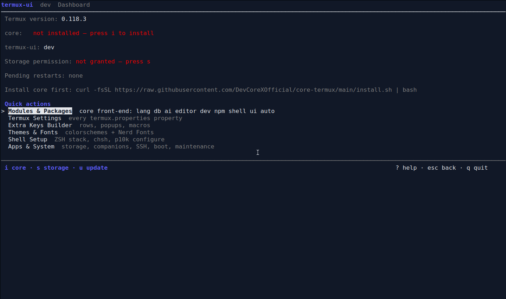
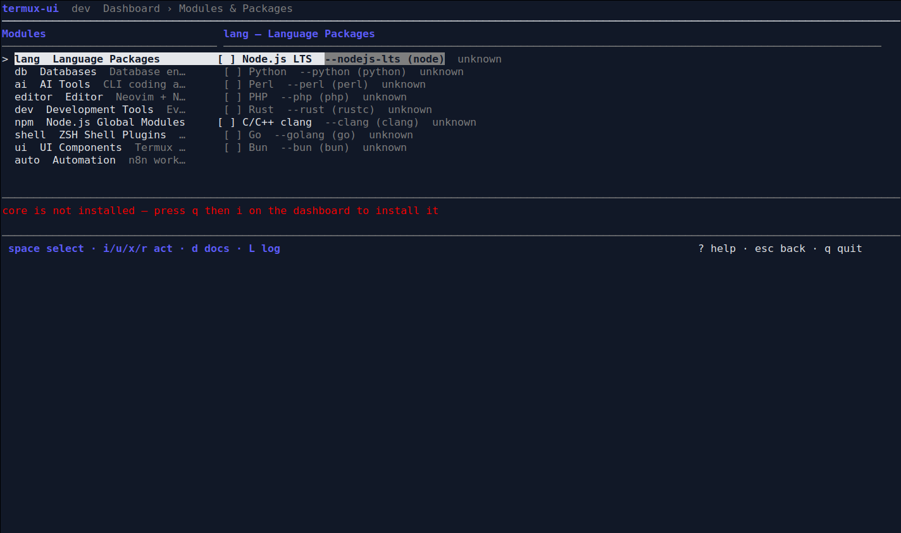
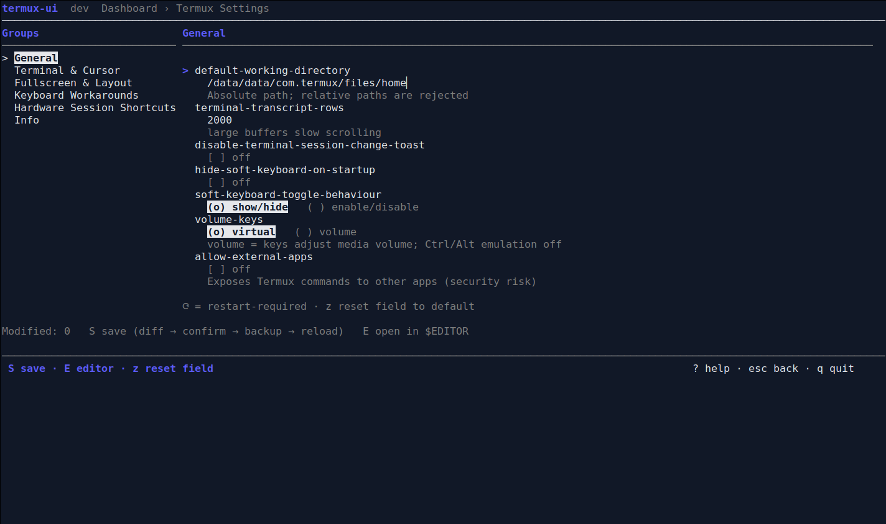
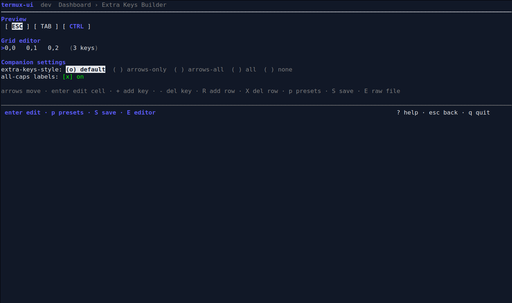
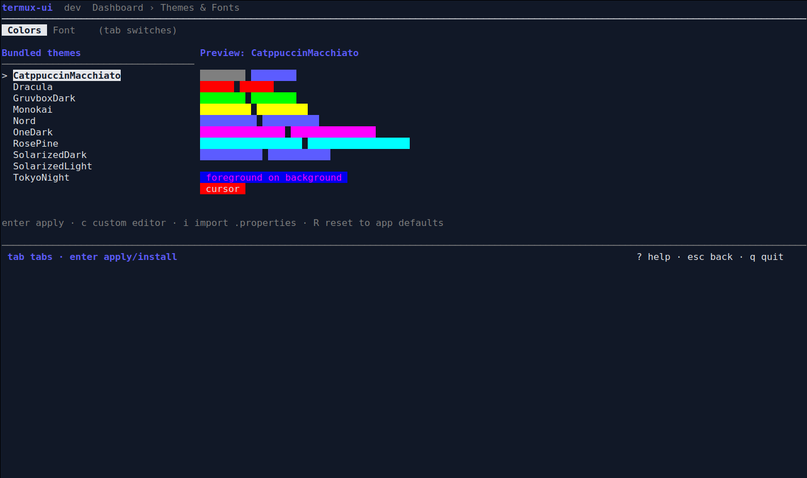

# termux-ui

A single-binary TUI for [Termux](https://termux.dev) that **customizes everything
configurable about the Termux app** and acts as a **menu front-end to the
[core-termux](https://github.com/DevCoreXOfficial/core-termux) CLI**.

Built with Go + Bubble Tea. Static binary, zero runtime dependencies — runs on a
fresh Termux install (aarch64 primary, arm secondary). Non-destructive by
design: every write to `~/.termux/*` shows a unified diff, asks for
confirmation, writes a timestamped backup, then runs `termux-reload-settings`.

## Install

```sh
curl -fsSL https://raw.githubusercontent.com/DevCoreXOfficial/termux-ui/main/install.sh | bash
```

The one-liner detects your arch, downloads the matching prebuilt binary from
GitHub Releases to `$PREFIX/bin/termux-ui`, and makes it executable.

Build it yourself on-device with Termux's own golang (`pkg install golang git`):

```sh
./build.sh           # native build -> ./termux-ui
./build.sh release   # cross-builds dist/termux-ui_linux_arm64 and _linux_arm
```

## Screens

These are live captures of the running TUI in an isolated terminal with temporary Termux environment variables (not an Android device). The temporary home has no installed `core` CLI and no granted storage. Select an image to open the full-size capture.

| Dashboard | Modules & Packages |
|---|---|
| <a href="docs/screenshots/dashboard.png"></a> | <a href="docs/screenshots/modules-packages.png"></a> |
| Termux Settings | Extra Keys Builder |
| <a href="docs/screenshots/termux-settings.png"></a> | <a href="docs/screenshots/extra-keys-builder.png"></a> |
| Themes & Fonts | |
| <a href="docs/screenshots/themes-fonts.png"></a> | |

| # | Screen | What it does |
|---|--------|--------------|
| 1 | **Dashboard** | Termux/core/termux-ui versions, storage permission, pending restarts; quick actions: install/update core (`i`), setup storage (`s`), self-update (`u`) |
| 2 | **Modules & Packages** | Browse core's modules (`lang db ai editor dev npm shell ui auto`) and tools with live install status; space-select tools, then run real `core install/update/uninstall/reinstall/show/open` with streamed output |
| 3 | **Termux Settings** | Every documented `termux.properties` property as typed controls (toggles, radios, numbers, text) in groups; diff → confirm → backup → write → reload; restart-required properties are tracked and surfaced on the dashboard |
| 4 | **Extra Keys Builder** | Visual grid editor for extra-keys layouts with popups (`P`) and macros (`M`), the full named-key palette, modifier-uniqueness and backslash rules, presets (Default / Single row / tmux / Vim), plus `extra-keys-style` and `extra-keys-text-all-caps` |
| 5 | **Themes & Fonts** | 10 bundled colorschemes with live swatch preview, custom 19-field hex editor, `.properties` import, reset; Nerd Font installs (MesloLGS NF direct from powerlevel10k-media; JetBrainsMono/FiraCode/CaskaydiaCove/Hack from ryanoasis release zips), local `.ttf`, remove font |
| 6 | **Shell Setup** | ZSH stack status via `core list shell`, plugin roster, install/update/reinstall stack, switch default shell (`chsh`), `p10k configure` |
| 7 | **Apps & System** | Storage permission, companion apps (Termux:API/Boot/Widget/Styling — F-Droid links + self-tests), SSH server wizard (install → password → start → login info → stop), boot script manager (templates, edit, delete), mirrors / upgrade / system info |

Global keys: `↑↓` move · `enter` select · `esc` back · `q` quit (top level) ·
`?` help · `1–7` jump to screen.

## Safety model

- Every config write previews **exactly the lines that change** (unified diff)
  and requires confirmation.
- Original files are copied to `<file>.bak.<YYYYmmdd-HHMMSS>` next to the
  original before any write.
- Comments and unknown keys in your existing properties files are preserved
  verbatim.
- Properties absent from the file show their built-in default and are only
  written when changed; resetting a field removes the key.
- Restart-required properties (`fullscreen`, `use-fullscreen-workaround`,
  `use-black-ui`, `terminal-cursor-style`, `terminal-cursor-blink-rate`) are
  recorded in `~/.cache/termux-ui/state.json` and surfaced as a dashboard
  banner instead of silently "applying".
- Long operations (core actions, pkg, downloads) stream their real output via
  `tea.ExecProcess`; failures show the tail of `~/.cache/core-termux/install_<module>.log`.

## Notes and deliberate deviations

- The SSH wizard reports the actual port from `$PREFIX/etc/ssh/sshd_config`
  (Termux default is **8022**); PLAN.md's example said 8020.
- Nerd-font zips are unpacked natively in Go — no `unzip` package needed,
  keeping the zero-runtime-dependency promise.
- If `core` is missing, screen 2 offers core's official installer:
  `curl -fsSL https://raw.githubusercontent.com/DevCoreXOfficial/core-termux/main/install.sh | bash`

## Development

```sh
go vet ./...
go test ./...        # includes headless TUI smoke tests driving every screen
./build.sh release
```

Versioning: CalVer `v0.YYMMDD` + short commit hash (see `build.sh`). Update
checks hit GitHub Releases at most once per 24 h.

MIT License. Not affiliated with the Termux project; companion apps must come
from F-Droid (Play Store builds are incompatible).
